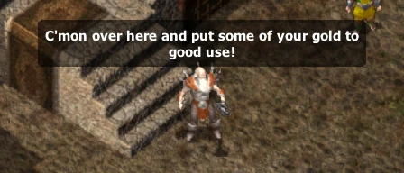

# Wares of the Planes
*A mod for BG:EE, SoD, BG2:EE and EET that imports a large number of items from the Planescape universe to the Baldur's Gate series and makes them available by a unique merchant.*

&nbsp;&nbsp;

## Overview

This mod introduces a large number of weapons and accessories from the Planescape universe in the Baldur's Gate series. The items can be purchased from from a travelling merchant who is available throughout the whole game.

Several items from Planescape: Torment have been slightly altered to fit better into the BG series since items from the Planescape universe are generally more powerful and unique than their Forgotten Realms counterparts.

The mod is available for BG:EE, Siege of Dragonspear, BG2:EE and EET (Enhanced Edition Trilogy).

## Components

### Wares of the Planes *(for BG:EE, SoD, BG2:EE and EET)*

This is the main component. It installs a large number of items from the Planescape universe which includes weapons, accessories, utility items, and more. They can be purchased from a unique travelling merchant who can be found in several towns and settlements throughout the whole Baldur's Gate series.

As the items vary greatly in power, they are only gradually made available as the main story of the game progresses.

Detailed descriptions of available items are listed here: [item-descriptions.txt](https://raw.githubusercontent.com/Argent77/A7-WaresOfThePlanes/master/A7-WaresOfThePlanes/doc/item-descriptions.txt)

### Identify all wares *(not recommended; requires the main component)*

This tweak automatically identifies all wares offered by the travelling merchant.

**Note:** It is generally not recommended to install this tweak as it diminishes the mod experience. Install it only if you want to complement Tweaks Anthology's subcomponent "Identify All Items" or similar tweaks.

### Alternate merchant portrait *(requires main component)*

This tweak installs Ebb Creakknees' original character portrait from Planescape: Torment.
